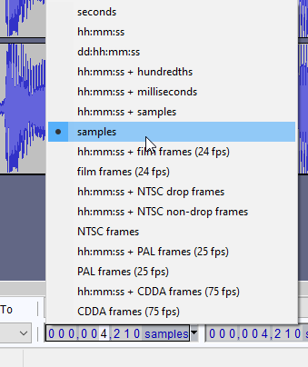

# ADX
Common audio format by criware used across many, many games. PSO and PSU used this for audio for bgm. PSO2's alpha clients also used it for bgm as well as sound clips.
These are lossy audio files with loop start and end points. The number of loops is also defineable. While there is a lot of conversion software, some of the older ones do not support loop points.

## RADX
A simple command line solution for converting to and from ADX. Dragging and dropping will work if no loop point is desired. Otherwise, it has a simple command line interface that it details on the main github page. Loop points are defined in audio samples.
Accepts .wav audio as input.

[Download :fontawesome-solid-download:](https://github.com/Isaac-Lozano/radx/releases){ .md-button .md-button--primary target="_blank"}
[GitHub Repository :fontawesome-brands-github:](https://github.com/Isaac-Lozano/radx){ .md-button target="_blank"}

## Audacity
A tool for general audio editing and conversion. Can convert most common audio formats to .wav for conversion by software such as RADX.
Also nice for finding sample timings. An example can be seen below of how to set the timing at the bottom to samples for usage with radx or other audio conversion software.
 

[Download :fontawesome-solid-download:](https://www.audacityteam.org/download/){ .md-button .md-button--primary target="_blank"}
[Source Code](https://www.audacityteam.org/download/source/){ .md-button target="_blank"}